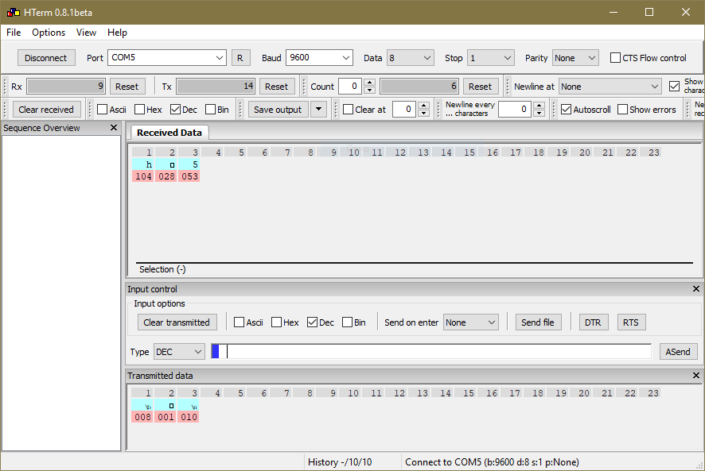
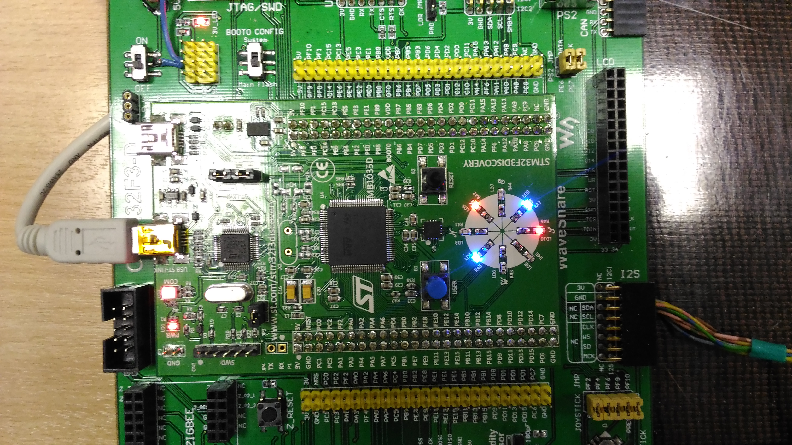

# STM32F-CRC

## Задание на курсовой проект
Реализовать программу для расчета CRC суммы с использованием аппаратных средств. Для этого необходимо с помощью UART передавать на микроконтроллер сообщение (формат сообщения определить самостоятельно), и с помощью встроенного CRC блока рассчитывать контрольную по полиному 8-й степени. Рассчитанную суммы (1 байт) отобразить с помощью светодиодной индикации.

## Результаты работы

# Мануалы. RTFM
1. [CRC алгоритм](https://www.st.com/content/ccc/resource/technical/document/application_note/39/89/da/89/9e/d7/49/b1/DM00068118.pdf/files/DM00068118.pdf/jcr:content/translations/en.DM00068118.pdf) также представлен ввиде python [скрипта](CRC.py)
2. [Reference manual](https://www.st.com/content/ccc/resource/technical/document/reference_manual/4a/19/6e/18/9d/92/43/32/DM00043574.pdf/files/DM00043574.pdf/jcr:content/translations/en.DM00043574.pdf)

